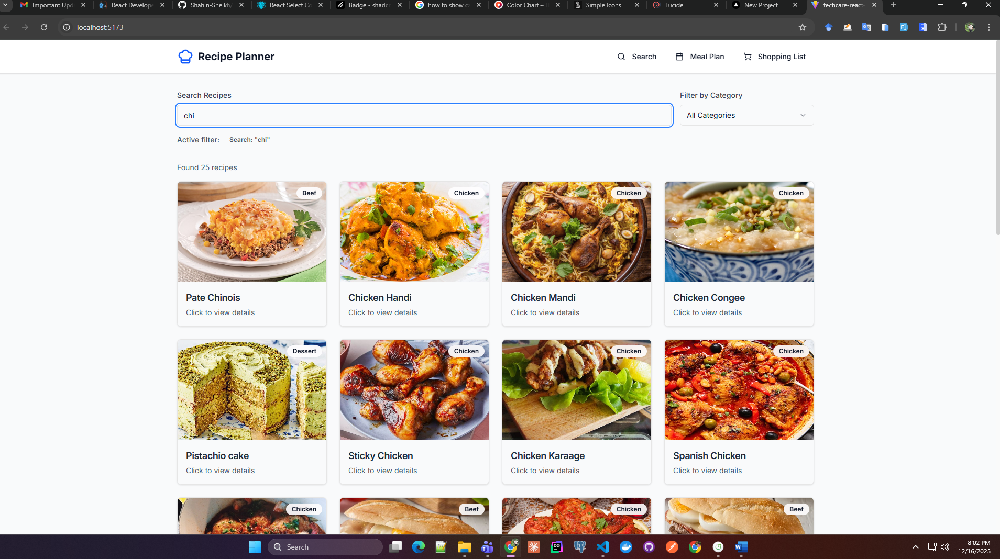
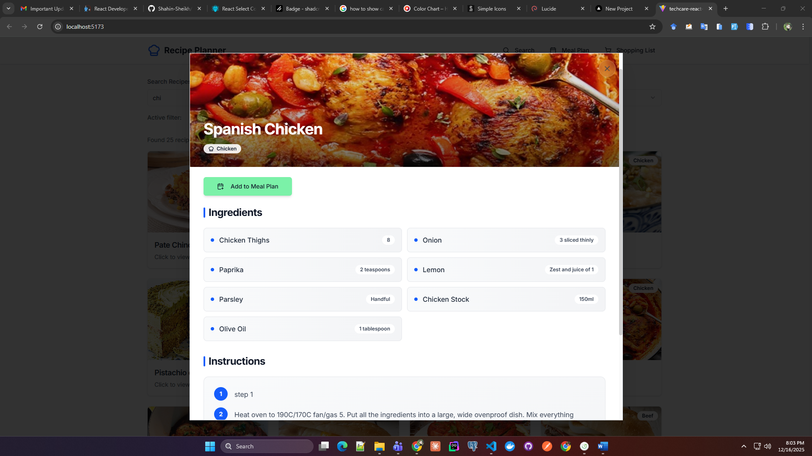
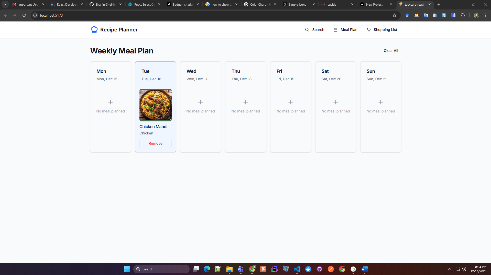
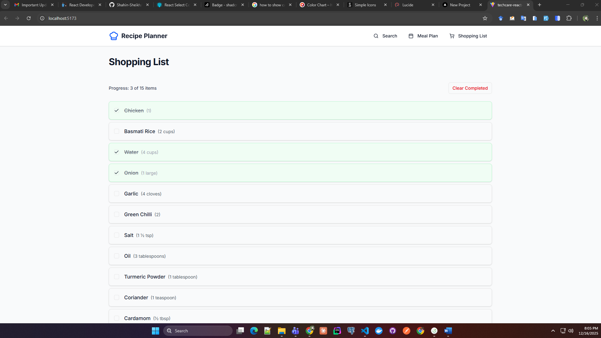

# Recipe Meal Planner

A modern, responsive web application for searching recipes, planning weekly meals, and generating shopping lists. Built with React, TypeScript, and TailwindCSS.

## 🚀 Live Demo

**[View Live Application →](https://shahin-vite-recipe-meal-planner.vercel.app/)**

> ✨ Try the live demo to explore all features instantly!

---

## Features

- 🔍 **Recipe Search & Browse**: Search recipes by name or filter by category
- 📖 **Recipe Details**: View comprehensive recipe information including ingredients, instructions, and video tutorials
- 📅 **Weekly Meal Planning**: Plan meals for the entire week with an intuitive calendar interface
- 🛒 **Smart Shopping List**: Automatically generate shopping lists from your meal plan with ingredient merging
- 📱 **Fully Responsive**: Optimized for mobile, tablet, and desktop devices
- 🎨 **Modern UI**: Clean, professional interface with smooth animations and transitions
- 🔔 **Toast Notifications**: Real-time feedback for user actions and errors

## Tech Stack

- **Framework**: React 19.2.0
- **Language**: TypeScript 5.9.3
- **Build Tool**: Vite 7.2.4
- **Styling**: TailwindCSS 4.1.18
- **UI Components**: Shadcn UI with Radix UI primitives
- **Icons**: Lucide React
- **Toast Notifications**: Sonner
- **API**: TheMealDB API

---

## Setup & Run

### Prerequisites

- **Node.js**: v20.12.1 or higher
- **npm**: v10.8.2 or higher

### Installation Steps

1. **Clone the repository**

   ```bash
   git clone https://github.com/Shahin-Sheikh/techcare-react-recipe-meal-planner.git
   cd techcare-react-recipe-meal-planner
   ```

2. **Install dependencies**

   ```bash
   npm install
   ```

3. **Run the development server**

   ```bash
   npm run dev
   ```

4. **Open your browser**
   Navigate to `http://localhost:5173`

### Environment Variables

No environment variables required. The application uses the free public [TheMealDB API](https://www.themealdb.com/api.php).

### Available Scripts

```bash
npm run dev      # Start development server
npm run build    # Build for production
npm run preview  # Preview production build
npm run lint     # Run ESLint
```

---

## Architecture Overview

### Folder Structure

```
src/
├── api/                    # API integration layer
│   └── mealdb.ts          # TheMealDB API client
├── components/
│   ├── common/            # Reusable common components
│   │   ├── EmptyState.tsx
│   │   ├── ErrorBoundary.tsx
│   │   └── ErrorMessage.tsx
│   └── ui/                # Shadcn UI components
│       ├── button.tsx
│       ├── card.tsx
│       ├── dialog.tsx
│       ├── input.tsx
│       ├── select.tsx
│       ├── skeleton.tsx
│       ├── sonner.tsx
│       └── ...
├── context/               # React Context for state management
│   └── MealPlanContext.tsx
├── features/              # Feature-based modules
│   ├── meal-plans/
│   │   ├── MealPlanView.tsx
│   │   └── ShoppingList.tsx
│   └── recipes/
│       ├── RecipeCard.tsx
│       ├── RecipeDetails.tsx
│       └── RecipeSearch.tsx
├── hooks/                 # Custom React hooks
│   ├── useMealPlan.ts
│   ├── useRecipeDetails.ts
│   └── useRecipes.ts
├── pages/                 # Page components
│   └── HomePage.tsx
├── types/                 # TypeScript type definitions
│   └── index.ts
├── utils/                 # Utility functions
│   └── helpers.ts
└── main.tsx              # Application entry point
```

### State Management Approach

**Context API + Custom Hooks Pattern**

I chose React's Context API over external state management libraries (Redux, Zustand) for several reasons:

1. **Simplicity**: The application's state requirements are straightforward
2. **No External Dependencies**: Reduces bundle size and complexity
3. **Built-in Solution**: Leverages React's native capabilities
4. **Sufficient Performance**: For this scale, Context API provides excellent performance

**Implementation**:

- `MealPlanContext`: Manages meal planning state with localStorage persistence
- Custom hooks (`useMealPlan`) provide clean API for components to interact with context
- State is colocated with business logic for better maintainability

### Custom Hooks Purpose

#### `useRecipes`

- **Purpose**: Handle recipe search and category filtering
- **Features**:
  - Debounced search to reduce API calls
  - Loading states and error handling
  - Toast notifications for API errors
- **Why**: Abstracts complex search logic from UI components

#### `useRecipeDetails`

- **Purpose**: Fetch and cache individual recipe details
- **Features**:
  - Automatic loading state management
  - Error handling with user-friendly messages
  - Toast notifications for failures
- **Why**: Separates data fetching concerns from presentation

#### `useMealPlan`

- **Purpose**: Interface to meal planning context
- **Features**:
  - Add/remove meals from weekly plan
  - LocalStorage persistence
  - Clear entire meal plan
- **Why**: Provides clean, type-safe API for meal plan operations

---

## Technical Decisions

### Key Technology Choices

#### 1. **Vite over Create React App**

- **Why**: Faster builds, better DX, native ESM support
- **Trade-off**: None - Vite is objectively superior for new projects

#### 2. **TailwindCSS 4.x**

- **Why**:
  - Utility-first approach for rapid development
  - Excellent responsive design utilities
  - Minimal CSS bundle size with tree-shaking
- **Trade-off**: Learning curve for team members unfamiliar with utility classes

#### 3. **Shadcn UI over Component Libraries**

- **Why**:
  - Copy-paste components (no runtime dependency)
  - Full customization control
  - Built on Radix UI primitives (accessibility)
  - Modern, professional design system
- **Trade-off**: Manual component updates required

#### 4. **Context API over Redux**

- **Why**:
  - Application state is relatively simple
  - No complex async orchestration needed
  - Reduces boilerplate code
  - No additional dependencies
- **Trade-off**: May need migration if app scales significantly

#### 5. **LocalStorage for Persistence**

- **Why**:
  - Simple, synchronous API
  - No backend required
  - Instant data persistence
- **Trade-off**:
  - Limited storage (5-10MB)
  - Not suitable for large datasets
  - No cross-device sync

#### 6. **Sonner for Toast Notifications**

- **Why**:
  - Excellent UX with stacking toasts
  - Minimal bundle size
  - Beautiful default animations
- **Trade-off**: None for this use case

### Design Patterns Used

1. **Custom Hooks Pattern**: Encapsulate reusable logic
2. **Compound Component Pattern**: Dialog, Select components
3. **Render Props Pattern**: ErrorBoundary component
4. **Container/Presenter Pattern**: Separating logic from UI

### What I Would Improve With More Time

1. **Testing**

   - Add unit tests with Vitest
   - Component tests with React Testing Library
   - E2E tests with Playwright

2. **Performance Optimizations**

   - Implement React.memo for expensive components
   - Add virtual scrolling for large recipe lists
   - Image lazy loading optimization
   - Service Worker for offline support

3. **Features**

   - User authentication and cloud sync
   - Multiple meal plans (breakfast, lunch, dinner)
   - Recipe rating and favorites
   - Nutritional information display
   - Print-friendly meal plan and shopping list
   - Export shopping list to various formats

4. **Code Quality**

   - Add Storybook for component documentation
   - Implement comprehensive error boundaries
   - Add analytics and error tracking (Sentry)
   - Improve TypeScript strict mode compliance

5. **Accessibility**

   - Full keyboard navigation
   - Screen reader optimization
   - WCAG 2.1 AA compliance audit
   - Focus management improvements

6. **Developer Experience**
   - Add pre-commit hooks (Husky)
   - Implement conventional commits
   - Add automated deployment pipeline
   - Docker containerization

---

## ⏱️ Time Breakdown

## ⏱️ Time Breakdown

| Task                                      | Time Spent   |
| ----------------------------------------- | ------------ |
| Project setup & configuration             | 2 hours      |
| Understanding requirements & planning     | 1.5 hours    |
| API integration & type definitions        | 2 hours      |
| Custom hooks implementation               | 3 hours      |
| State management (Context + localStorage) | 1.5 hours    |
| UI component setup (Shadcn)               | 1.5 hours    |
| Recipe search & filter feature            | 2.5 hours    |
| Recipe details modal                      | 1.5 hours    |
| Weekly meal plan feature                  | 2 hours      |
| Shopping list with merging logic          | 1.5 hours    |
| Responsive design implementation          | 2.5 hours    |
| Toast notifications integration           | 1 hour       |
| Error handling & edge cases               | 1 hour       |
| UI/UX refinements & polish                | 1 hour       |
| Testing & bug fixes                       | 0.5 hour     |
| **Total**                                 | **22 hours** |

---

## Challenges Faced

### 1. **Ingredient Merging Logic**

**Problem**: Shopping list needed to merge ingredients with the same name but different measurements (e.g., "2 cups" + "1 cup" should show both, not combine).

**Solution**:

- Created a smart merging algorithm in `utils/helpers.ts`
- Groups ingredients by normalized name
- Preserves individual measurements when combining similar items
- Handles edge cases like undefined measurements

```typescript
// Example: Multiple recipes with "Chicken Breast"
// Input: [{ name: "Chicken Breast", measure: "500g" }, { name: "Chicken Breast", measure: "300g" }]
// Output: [{ name: "Chicken Breast", measure: "500g, 300g" }]
```

### 2. **API Rate Limiting & Performance**

**Problem**: TheMealDB API has rate limits, and fetching multiple recipe details sequentially was slow.

**Solution**:

- Implemented parallel API calls using `Promise.all()`
- Added debouncing to search input (500ms delay)
- Implemented loading skeletons for better perceived performance
- Used React's `useMemo` and `useCallback` to prevent unnecessary re-renders

### 3. **State Persistence Across Page Refreshes**

**Problem**: Users lose their meal plan when refreshing the page.

**Solution**:

- Implemented localStorage integration in `MealPlanContext`
- Automatic serialization/deserialization of meal plan state
- Added error handling for localStorage quota exceeded
- State rehydration on app initialization

### 4. **Complex Dialog State Management**

**Problem**: Managing recipe modal state while maintaining proper cleanup and preventing memory leaks.

**Solution**:

- Lifted modal state to parent component (`HomePage`)
- Used controlled components pattern
- Proper cleanup with `useEffect` return functions
- Escape key handler for better UX

### 5. **Responsive Design Consistency**

**Problem**: Ensuring consistent UX across all device sizes, especially the meal plan grid layout.

**Solution**:

- Used TailwindCSS breakpoints systematically
- Created responsive grid: 1 → 2 → 3 → 4 → 7 columns
- Adjusted font sizes, padding, and spacing for each breakpoint
- Tested on multiple devices and screen sizes

### 6. **TypeScript Type Safety with API Data**

**Problem**: TheMealDB API returns nullable fields and inconsistent data structures.

**Solution**:

- Created comprehensive type definitions in `types/index.ts`
- Added runtime validation in API layer
- Used optional chaining and nullish coalescing
- Type guards for array operations

### 7. **Toast Notification Timing**

**Problem**: Needed to show detailed API errors in toasts while keeping UI error messages generic.

**Solution**:

- Dual-level error handling pattern
- Detailed errors → Toast notifications (Sonner)
- Generic errors → UI error components
- Proper error message formatting for user-friendliness

---

## Screenshots

### Recipe Search Page


_Search and filter recipes by name or category with real-time results_

### Recipe Details View


_Comprehensive recipe information with ingredients, instructions, and video tutorial_

### Weekly Meal Plan


_Visual calendar view of your weekly meal plan with easy management_

### Shopping List


_Auto-generated shopping list with progress tracking and item checking_

### Mobile Responsive View


_Fully responsive design optimized for mobile devices_

---

## API Documentation

The application uses the [TheMealDB API](https://www.themealdb.com/api.php) (free tier):

- Search recipes: `https://www.themealdb.com/api/json/v1/1/search.php?s={query}`
- Filter by category: `https://www.themealdb.com/api/json/v1/1/filter.php?c={category}`
- Get recipe details: `https://www.themealdb.com/api/json/v1/1/lookup.php?i={id}`
- List categories: `https://www.themealdb.com/api/json/v1/1/categories.php`

---

## Browser Support

- Chrome/Edge (latest 2 versions)
- Firefox (latest 2 versions)
- Safari (latest 2 versions)
- Mobile browsers (iOS Safari, Chrome Mobile)

---

## Contributing

This is a personal project created for a technical assessment. However, suggestions and feedback are welcome!

---

## License

This project is created for educational and assessment purposes.

---

## Author

**Shahin Sheikh**

- GitHub: [@Shahin-Sheikh](https://github.com/Shahin-Sheikh)
- Project Link: [techcare-react-recipe-meal-planner](https://github.com/Shahin-Sheikh/techcare-react-recipe-meal-planner)

---

## Acknowledgments

- [TheMealDB](https://www.themealdb.com/) for the free recipe API
- [Shadcn UI](https://ui.shadcn.com/) for the beautiful component library
- [Lucide](https://lucide.dev/) for the icon set
- [Radix UI](https://www.radix-ui.com/) for accessible primitives
